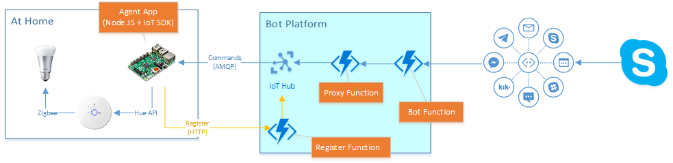

# HueBot

This chatbot will rule your Hue lights.

However, sending commands to the Hue Bridge in your home is hard (because of the security, and it's good). This means we need a bit of architecture in order to be able to talk to the Hue Bridge inside your home network.

## Overall architecture



## Hue Agent

In order to be able to talk to your Hue Bridge, the Bot needs you to run an Agent from a machine connected to your local network.

``` sh
cd HueAgent
npm install
node app.js [username]
```

If you don't have a username, omit it and the Agent will create one for you. Please copy it somewhere, and pass it as a parameter the next time you start the Agent!

The Agent will print a UUID (unique identifier) for your Hue Bridge. You will need to give this UUID to the Hue Bot so it can communicate with your lights.

TODO: package the Agent as a Docker image so it is easier to start e.g. from a Raspberry Pi device.

## Hue Proxy

The Agent will then communicate with a Proxy service hosted in Azure, using the secure Azure IoT Hub service. This Proxy service will allow the Bot to send commands to your Hue installation.

## Hue Bot

TBD
